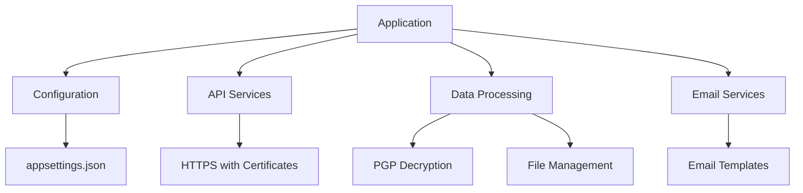

# APSAMLO Project - AML Data Processing System

## Overview

The APSAMLO (AML Processing System) is a .NET application designed to securely retrieve, process, and distribute Anti-Money Laundering (AML) data from various regulatory sources. The system automatically checks for data version updates, decrypts PGP-encrypted files, and sends notifications with processed data to designated recipients.

## Key Features

- 🔒 **Secure Data Retrieval**: Uses client certificates and API keys for authentication
- 🔄 **Automatic Version Checking**: Regularly checks for updates to AML lists
- 📧 **Email Notifications**: Sends processed data with status updates
- 🗄️ **Data Backup**: Maintains backup copies of all processed files
- ⏱️ **Scheduled Processing**: Can be configured to run at regular intervals

## System Architecture



## Getting Started

### Prerequisites

- .NET 9.0 SDK
- Valid SSL certificate for API authentication
- PGP key pair for file decryption
- SMTP server access for email notifications

### Installation

1. Clone the repository
2. Configure `appsettings.json` with your settings:
   ```json
   {
     "AppSettings": {
       "x-api-key": "your-api-key",
       "certificatepassword": "cert-password",
       "certificate": "path/to/cert.pfx",
       "username": "api-username",
       "password": "api-password"
     }
   }
   ```
3. Build the project:
   ```bash
   dotnet build
   ```

### Configuration

Key configuration options in `appsettings.json`:

| Setting | Description |
|---------|-------------|
| `ProcessPath` | Temporary processing directory |
| `ZipFilePath` | Output directory for decrypted files |
| `BackupPath` | Backup directory for processed files |
| `KeyFile` | Path to PGP private key |
| `PassPhrase` | PGP key passphrase |
| `MailAPI` | Email service endpoint |

## Usage

Run the application:

```bash
dotnet run
```

The system will:
1. Check for updated versions of all AML lists
2. Download and decrypt any new data
3. Send email notifications with attachments
4. Maintain backup copies of all files

## Error Handling

The system logs all activities and errors using log4net. Check the log files for troubleshooting.

## Dependencies

| Package | Purpose |
|---------|---------|
| ChoPGP.Core | PGP file decryption |
| log4net | Logging |
| Microsoft.Extensions.Configuration | Configuration management |
| Newtonsoft.Json | JSON processing |

## Security Considerations

- All API communications use HTTPS with client certificates
- Sensitive credentials are not hardcoded (use configuration files)
- PGP encryption for file transfers
- Proper file cleanup after processing
  
---
